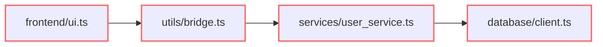
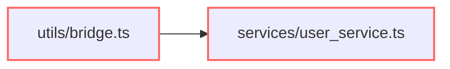
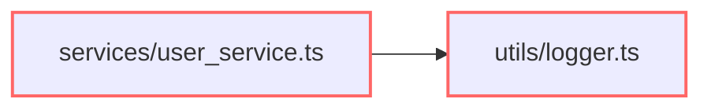

# Orbit Architect Report

Architecture documentation was compiled into 3 executable constraints.

GitLab Orbit extracted repository relationships from the AST graph.

Orbit Architect evaluated those relationships against architectural policy.

**Repository Status: ❌ FAILED**

3 architectural violations detected.
Merge should not proceed until critical violations are resolved.

❌ Critical: 1
⚠️ High: 1
⚠️ Medium: 1

---

❌ CRITICAL VIOLATION

Rule (ARCH-001):
Frontend must never depend on Database

Violation Path:
frontend/ui.ts → utils/bridge.ts → services/user_service.ts → database/client.ts

Impact:
frontend is now transitively coupled to database.

Why This Rule Exists:
The frontend module should communicate through abstractions rather than direct structural coupling to database.

Suggested Refactor:
Introduce an abstraction boundary or intermediate service to decouple these domains.

Mermaid Graph:

---

⚠️ HIGH VIOLATION

Rule (ARCH-002):
Utils must never depend on services

Violation Path:
utils/bridge.ts → services/user_service.ts

Impact:
utils directly depends on services.

Why This Rule Exists:
The utils module should communicate through abstractions rather than direct structural coupling to services.

Suggested Refactor:
Introduce an abstraction boundary or intermediate service to decouple these domains.

Mermaid Graph:

---

⚠️ MEDIUM VIOLATION

Rule (ARCH-003):
Services may only depend on:
- Database

Violation Path:
services/user_service.ts → utils/logger.ts

Impact:
An unauthorized dependency was introduced in services.

Why This Rule Exists:
The services module operates under a strict Allowed Dependency Set.

Suggested Refactor:
Remove the unauthorized import or update the architecture documentation if this is an intentional structural shift.

Mermaid Graph:
